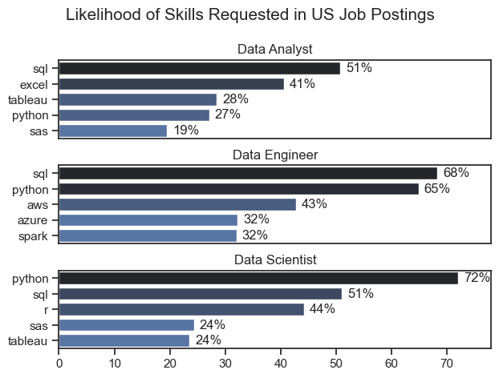
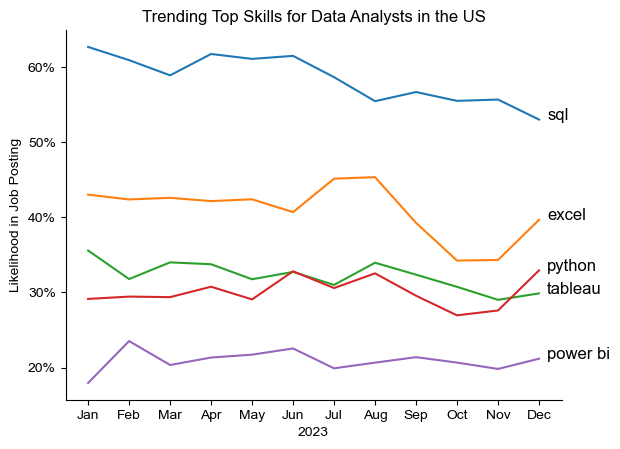
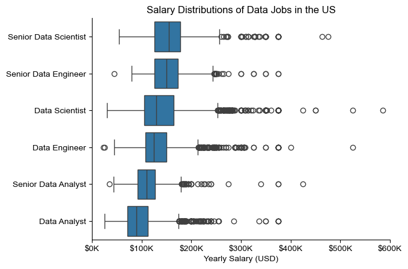
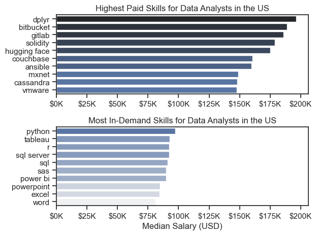
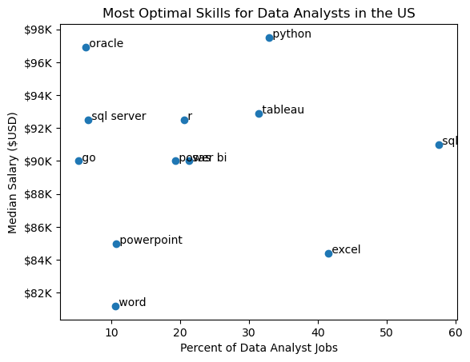

# Tổng quan

Phân tích về thị trường việc làm dữ liệu, tập trung vào vai trò của nhà phân tích dữ liệu. Dự án này được tạo ra từ mong muốn điều hướng và hiểu thị trường việc làm hiệu quả hơn. Nó đi sâu vào các kỹ năng được trả lương và theo yêu cầu hàng đầu để giúp tìm cơ hội việc làm tối ưu cho các nhà phân tích dữ liệu


# Các câu hỏi


1. Các kỹ năng phổ biến nhất trong ngành dữ liệu là gì?
2. Xu hướng các kĩ năng theo yêu cầu trong công việc Data Analysts là gì?
3. Mức lương dựa theo kỹ năng và công việc trong ngành dữ liệu?
4. Kỹ năng tối ưu nhất để trở thành một Data Analysis là gì?

# Công cụ sử dụng

- **Python:** Các thư viện:
    - **Pandas Library** 
    - **Matplotlib Library**
    - **Seaborn Library**
- **Jupyter Notebooks**
- **Visual Studio Code**
- **Git & GitHub**

# Chuẩn bị dữ liệu là làm sạch

Các bước được thực hiện để chuẩn bị dữ liệu để phân tích, đảm bảo độ chính xác và khả năng sử dụng.

## Khai báo và làm sạch dữ liệu

Bắt đầu bằng cách nhập các thư viện cần thiết và tải bộ dữ liệu, theo sau là các tác vụ làm sạch dữ liệu ban đầu để đảm bảo chất lượng dữ liệu.

```python
# Importing Libraries
import ast
import pandas as pd
import seaborn as sns
from datasets import load_dataset
import matplotlib.pyplot as plt  

# Loading Data
dataset = load_dataset('lukebarousse/data_jobs')
df = dataset['train'].to_pandas()

# Data Cleanup
df['job_posted_date'] = pd.to_datetime(df['job_posted_date'])
df['job_skills'] = df['job_skills'].apply(lambda x: ast.literal_eval(x) if pd.notna(x) else x)
```

## Lọc dữ liệu

Tập trung phân tích vào thị trường Hoa Kỳ.

```python
df_US = df[df['job_country'] == 'United States']

```

# Phân tích

Mỗi Jupyter notebook đối với dự án này nhằm mục đích điều tra các khía cạnh cụ thể của thị trường việc làm dữ liệu. Đây là cách tôi tiếp cận từng câu hỏi:

## 1. Các kỹ năng phổ biến nhất trong ngành dữ liệu là gì?

Để tìm các kỹ năng được yêu cầu nhất cho 3 vai trò dữ liệu phổ biến nhất hàng đầu. Tôi đã lọc ra những vị trí mà các vị trí là phổ biến nhất và có 5 kỹ năng hàng đầu cho 3 vai trò hàng đầu này. Truy vấn này nêu bật các tiêu đề công việc phổ biến nhất và các kỹ năng hàng đầu của họ, cho thấy những kỹ năng nào tôi nên chú ý vào tùy thuộc vào vai trò tôi đang nhắm mục tiêu.

Xem chi tiết tại đây: [Skill_Demand](Skill_Demand.ipynb).

### Trực quan hóa dữ liệu

```python
fig, ax = plt.subplots(len(job_titles), 1)


for i, job_title in enumerate(job_titles):
    df_plot = df_skills_perc[df_skills_perc['job_title_short'] == job_title].head(5)[::-1]
    sns.barplot(data=df_plot, x='skill_percent', y='job_skills', ax=ax[i], hue='skill_count', palette='dark:b_r')

plt.show()
```

### Kết quả


*Biểu đồ mức lương cho 3 công việc dữ liệu hàng đầu và 5 kỹ năng hàng đầu liên quan đến mỗi công việc.*


### Thông tin chi tiết:

- SQL là kỹ năng được yêu cầu nhiều nhất cho Data Analysts and Data Scientists, với nó trong hơn một nửa các bài đăng công việc cho cả hai vai trò. Đối với Data Engineers, Python là kỹ năng được tìm kiếm nhiều nhất, xuất hiện trong 68% các bài đăng công việc.
- Data Engineers yêu cầu nhiều kỹ năng kỹ thuật chuyên dụng hơn (AWS, Azure, Spark) so với Data Analysts and Data Scientists - những người dự kiến ​​sẽ thành thạo các công cụ phân tích và quản lý dữ liệu chung hơn (Excel, Tableau).
- Python là một kỹ năng yêu cầu cao trong cả ba vai trò, nhưng nổi bật nhất đối với Data Scientists (72%) và Data Engineers (65%)

## 2. Xu hướng các kĩ năng theo yêu cầu trong công việc Data Analysts là gì?

Để tìm ra cách các kỹ năng có xu hướng vào năm 2023 đối với  Data Analysts, tôi đã lọc các vị trí của data analyst và nhóm các kỹ năng theo tháng của các bài đăng công việc. Điều này giúp tôi có 5 kỹ năng phân tích dữ liệu hàng đầu theo tháng, cho thấy các kỹ năng phổ biến trong suốt năm 2023.

Xem chi tiết tại đây: [Skills_Trend](Skill_Trend.ipynb).

### Trực quan hóa dữ liệu

```python

from matplotlib.ticker import PercentFormatter

df_plot = df_DA_US_percent.iloc[:, :5]
sns.lineplot(data=df_plot, dashes=False, legend='full', palette='tab10')

plt.gca().yaxis.set_major_formatter(PercentFormatter(decimals=0))

plt.show()

```

### Kết quả

  
*Biểu đồ các kỹ năng hàng đầu có xu hướng cho data analysts ở Mỹ vào năm 2023.*

### Thông tin chi tiết:
- SQL vẫn là kỹ năng được yêu cầu nhất quán nhất trong suốt cả năm, mặc dù nó cho thấy nhu cầu giảm dần.
- Excel đã trải qua một sự gia tăng đáng kể nhu cầu bắt đầu vào khoảng tháng 9, vượt qua cả Python và Tableau vào cuối năm nay.
- Cả Python và Tableau đều cho thấy nhu cầu tương đối ổn định trong suốt cả năm với một số biến động nhưng vẫn là kỹ năng thiết yếu cho các nhà phân tích dữ liệu. Power Bi, trong khi ít yêu cầu hơn so với những người khác, cho thấy một xu hướng tăng nhẹ vào cuối năm.

## 3. Mức lương dựa theo kỹ năng và công việc trong ngành dữ liệu?

Xác định vai trò và kỹ năng được trả lương cao nhất.

Xem chi tiết tại đây: [Salary_Analysis](Salary_Analysis.ipynb).

#### Trực quan hóa dữ liệu

```python
sns.boxplot(data=df_US_top6, x='salary_year_avg', y='job_title_short', order=job_order)

ticks_x = plt.FuncFormatter(lambda y, pos: f'${int(y/1000)}K')
plt.gca().xaxis.set_major_formatter(ticks_x)
plt.show()

```

#### Results

  
*Biểu đồ hình ảnh trực quan hóa mức tiền lương cho 6 công việc dữ liệu hàng đầu.*

#### Thông tin chi tiết: 

- Có một sự thay đổi đáng kể về phạm vi tiền lương trên các chức danh công việc khác nhau. Các vị trí của Senior Data Scientist có xu hướng có tiềm năng lương cao nhất, lên tới $600K, cho thấy giá trị cao được đặt trên các kỹ năng và kinh nghiệm dữ liệu nâng cao trong ngành.

- Mức lương trung bình tăng theo thâm niên và chuyên môn hóa các vai trò.Senior roles (Senior Data Scientist, Senior Data Engineer) không chỉ có mức lương trung bình cao hơn mà còn có sự khác biệt lớn hơn về mức lương điển hình, phản ánh sự khác biệt lớn hơn trong bồi thường khi trách nhiệm tăng lên.

### Các kỹ năng được trả lương cao nhất và các kỹ năng được yêu cầu cao nhất từ phía nhà tuyển dụng


#### Trực quan hóa dữ liệu

```python

fig, ax = plt.subplots(2, 1)  

# Top 10 Highest Paid Skills for Data Analysts
sns.barplot(data=df_DA_top_pay, x='median', y=df_DA_top_pay.index, hue='median', ax=ax[0], palette='dark:b_r')

# Top 10 Most In-Demand Skills for Data Analystsr')
sns.barplot(data=df_DA_skills, x='median', y=df_DA_skills.index, hue='median', ax=ax[1], palette='light:b')

plt.show()

```

#### Kết quả


*Các kỹ năng được trả lương cao nhất và hầu hết các kỹ năng theo yêu cầu cho data analysts ở Mỹ.*

#### Thông tin chi tiết:

- Biểu đồ hàng đầu cho thấy các kỹ năng kỹ thuật chuyên ngành như `dplyr`, `Bitbucket`, và `Gitlab` có liên quan đến mức lương cao hơn, some reaching up to $200K, cho thấy rằng trình độ kỹ thuật nâng cao có thể tăng tiềm năng kiếm tiền.

- Biểu đồ dưới cùng nhấn mạnh rằng các kỹ năng nền tảng như `Excel`, `PowerPoint`, và `SQL` có nhu cầu cao nhất, mặc dù có thể không đạt được mức lương cao nhất. Điều này cho thấy tầm quan trọng của các kỹ năng cốt lõi này đối với khả năng làm việc trong vai trò phân tích dữ liệu.

- Có một sự khác biệt rõ ràng giữa các kỹ năng được trả lương cao nhất và những kỹ năng được trả lương cao nhất và có nhu cầu cao nhất. Data analysts có mục đích tối đa hóa tiềm năng nghề nghiệp của họ nên xem xét phát triển một bộ kỹ năng đa dạng bao gồm cả các kỹ năng chuyên môn có lương cao và các kỹ năng nền tảng được yêu cầu rộng rãi.

## 4. Kỹ năng tối ưu nhất để trở thành một Data Analysis là gì?

Xác định các kỹ năng tối ưu nhất để học 

Xem chi tiết tại đây: [Optimal_Skills](Optimal_Skill.ipynb).

#### Trực quan hóa dữ liệu

```python

import matplotlib.pyplot as plt

plt.scatter(df_DA_skills_high_demand['skill_percent'], df_DA_skills_high_demand['median_salary'])
plt.show()

```

#### Results

    
*Một biểu đồ phân tán biểu thị các kỹ năng tối ưu nhất (trả lương cao & nhu cầu cao) cho data analytics ở Mỹ.*

#### Insights:

- Kỹ năng `Oracle` dường như có mức lương trung bình cao nhất gần $97K, mặc dù ít phổ biến hơn trong các bài đăng công việc. Điều này cho thấy một giá trị cao được đặt trên các kỹ năng cơ sở dữ liệu chuyên dụng trong nghề data analyst profession.

- Các kỹ năng thường được yêu cầu hơn như `Excel` và `SQL` có sự xuất hiện lớn trong danh sách công việc nhưng mức lương trung bình thấp hơn so với các kỹ năng chuyên môn như `Python` và `Tableau`, không chỉ có mức lương cao hơn mà còn phổ biến vừa phải trong danh sách công việc.

- Các kỹ năng như `Python`, `Tableau`, và `SQL Server`  hướng tới mức cao hơn của phổ lương trong khi cũng khá phổ biến trong danh sách công việc, cho thấy sự thành thạo trong các công cụ này có thể dẫn đến cơ hội tốt trong data analytics.


# Kết luận

- **Nhu cầu kỹ năng và mức lương**: Có một mối tương quan rõ ràng giữa nhu cầu về các kỹ năng cụ thể và mức lương này chỉ huy các kỹ năng này. Các kỹ năng nâng cao và chuyên môn như Python và Oracle thường dẫn đến mức lương cao hơn.
- **Xu hướng thị trường**: Có những xu hướng thay đổi trong nhu cầu kỹ năng, làm nổi bật bản chất năng động của thị trường việc làm dữ liệu. Theo kịp các xu hướng này là điều cần thiết cho sự phát triển nghề nghiệp data analytics.
- **Giá trị của các kĩ năng**: Hiểu những kỹ năng nào cả theo yêu cầu và bù đắp tốt có thể hướng data analytics trong việc ưu tiên học tập để tối đa hóa thu nhập của họ.